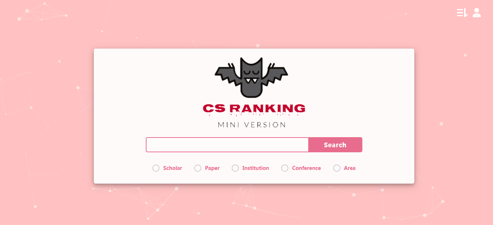

# Mini-CS Ranking


Mini-CS Ranking for *Database* 2019 Spring @ Fudan University, by [**Xinyi Zhou**](<https://github.com/veghen>) and [**Zuobai Zhang**](<https://oxer11.github.io/>)


## What's This

This is the mid-term project for our database course. In this project, we are required to develop a DB-based application in a practical scenario. Here are the detailed [requirements](doc/project01.pdf) and our [report](doc/report.pdf). 

Mini-CS Ranking is a Web application for ranking computer science departments according to their research output in selective venues, which is inspired by the open-source website [CSRankings: Computer Science Rankings](http://csrankings.org/#/index?all). It also supports some handy functions of [GoogleScholar](<https://scholar.google.com/>) and [DBLP](<https://dblp.uni-trier.de/>), such as search for papers/scholars by keywords and scan papers on specific conferences or in certain areas.

Now, enjoy yourself playing with this tiny website and feel free to give us your feedbacks :stuck_out_tongue_winking_eye:.


## How To Use

### Prerequisites

```
Python 3.7.2
Django 2.1.7
```

### Usage

```bash
# Clone this repository
$ git clone https://github.com/Oxer11/miniCSRanking.git

# Go into the repository
$ cd miniCSRanking

# Run server
$ python manage.py runserver
Performing system checks...

System check identified no issues (0 silenced).
April 20, 2019 - 23:27:10
Django version 2.1.7, using settings 'miniCSRanking.settings'
Starting development server at http://127.0.0.1:8000/
Quit the server with CTRL-BREAK.

```

Now, you can play with the Mini-CS Ranking website by accessing the link http://127.0.0.1:8000/ :wink:.


## Features

- Analogous to CSRankings, Mini-CS Ranking rates institutions according to their recent publication numbers. However, there are two limits of our website: 
  1. Due to the limited size of data, we only consider the recent five years publication on a few top conferences (in fact, the conference list is a proper subset of CSRankings) :pensive:. 
  2. Since it's a time-consuming task to rank institutions in terms of selected areas, we omit this function and just sift related scholars below each institution.
- The scholar's homepage/GoogleScholar/DBLP is accessible at their pages, where their recent papers and co-authors are also listed and the histogram displays their recent publication numbers. This feature plays a significant role in GoogleScholar, hence we reproduce it in Mini-CS Ranking.
- Searching is supported as well. Similar to DBLP, you can search for conferences/papers/scholars/institutions and even your favorite areas. The search results will be listed in a decreasing order with respect to the total publication numbers.
- Additionally, we add some login user features to accomplish our project requirements.  After registration, you can write your notes for some papers and make comments on others' notes. For the sake of convenience, you can follow your interested scholars and be notified by their new published paper.
- Finally, if you are a scholar recorded in our database, you can complete the authentication during your registration. Then, you can add your new paper at your profile interface and your followers will be instantly notified :grinning:.

Thus, it comes to the conclusion that Mini-CS Ranking is a mini-combination of CSRankings, GoogleScholar and DBLP with friendly GUI and extra login features.


## Imported Components

The website is built with some elegant components and we illustrate some as follow:

- The lovely Mini-CS Ranking logo is created using [DesignEvo](<https://www.designevo.com/>), a free online logo maker. Thousands of templates make it possible to bring to life a compelling, unique logo for you in minutes. 
- The impressive background of Mini-CS Ranking is from [particle.js](<https://github.com/VincentGarreau/particles.js>), a lightweight JavaScript library for creating particles, which I had intended to apply to my personal website but failed due to its unfitness as a blog background :unamused:.
- The beautiful charts at pages of scholar/institutions are made by [Highcharts](<https://www.highcharts.com.cn/>), which facilitate the visualization process of data. Intrigued by its exquisiteness, I am eager to share this pragmatic tool with you and highly recommend you to exploit and make extensive use of it :heart_eyes:. 
- Other small components can be obtained from [Free Frontend](<https://freefrontend.com/>). It provides a large volume of html components, which relieves our pain of frontend design :blush:.
- The core code of rank list is referred to the source code of CSRankings from <https://github.com/emeryberger/CSrankings>. Actually, its implementation is complicated for us to construe, so we simplify the code by omitting some intricate functions :confused:.


## Acknowledgments

- Thanks to the teaching assistants for revising our work.
- Thanks to the creative developers of [CSRankings](<https://github.com/emeryberger/CSrankings>) for presenting such an inspired website.
- Thanks to my thoughtful collaborator for warm encouragement and support! Without your help, it would be impossible for me to complete this fantastic project.
- Thanks to the future user of this website and all your suggestions are welcomed!

